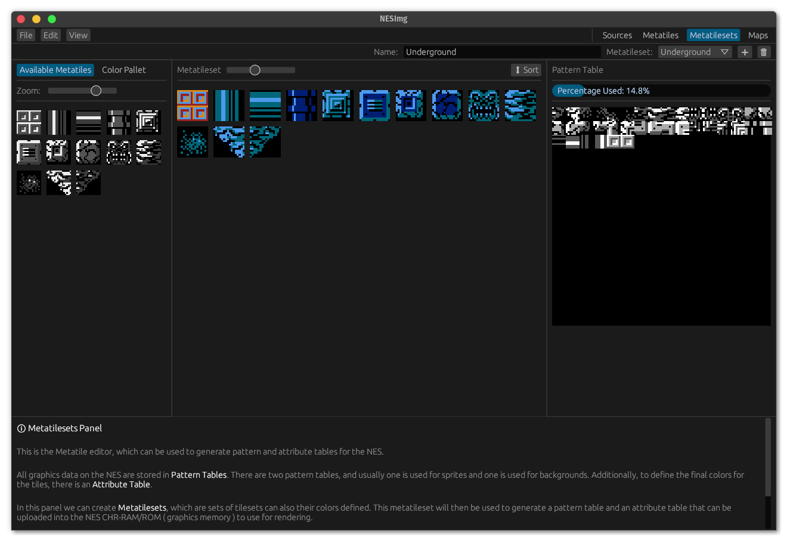

# NESImg

An extremely work-in-progress tool for making NES/Famicom-compatible images.

When faced with the challenge of formatting artwork in a way that it can be rendered on the NES, you run into many different limitations. For instance:

- You have two different kinds of rendering, background, and sprites.
- For either one, you only have 13 colors you can use.
- For each 8x8 tile in the background, you can only use 4 colors.
- Furthermore, you can't just pick any four colors out of your 13 background colors: you have to organize your background colors into 4 sets of 4 color pallets, each one which shares the same first color, and each background tile has to use one of those pallets.
- To make things more complicated, each set of 16x16 pixels in your background has to use the _same_ pallet.
- Now you have to fit all of of your background tiles into a 128x128 pixel space, because that's all the video memory you have for the background.

With all of these rules, you are now faced with building, for instance, a map for your game. And our modern editing tools don't take any of these rules into account. What's to make sure that the person who makes your background tiles only ever uses four colors? What's to make sure that the person who creates your map makes sure they use the same pallet for each 16x16 tile of pixels?

That's the challenge that NESImg ( pronounced NES-image ) seeks to solve.

## Editing Workflow

NESImg will use a simple workflow:

1. Take **Source Images** created with any image editing software, such as [Aseprite] or [Pixelorama], and add them to your NESImg project.
    - Each source image must use only four colors, this is enforced by NESImg when importing.
    - All source images are **hot reloaded**, meaning you can keep your pixel editor open and watch the changes update live in NESImg without restarting.
2. You then create **Metatiles** out of your source images.
    - A metatile is a 16x16 pixel square made out of 4 8x8 squares.
    - If your source image is already made out of 16x16 squares, you can all your metatiles at once.
3. You organize your metatiles into **Metatilesets**.
    - Metatilesets are a collection of metatiles.
    - You select 13 colors to use for the metatileset pallet.
    - You can colorize each of your metatiles in the pallet, with NESImg making sure you follow all the color rules.
    - NESImg will generate an NES *pattern table* and *attribute table* that can be uploaded to the NES CHR ROM/RAM for rendering.
    - NESImg will make sure that your metatiles are able to fit into the 128x128 pixel NES pattern table.
4. You build **Maps** out of your Metatiles.
    - Maps can have multiple levels
    - For each level you must select exactly *one* Metatileset which may be used to build the level background.
    - The map levels can be exported to a binary format that can be read on the NES to render the map.

## Current Status

NESImg is currently experimental. Currently working and non-working features:

- [x] Selecting source images
- [x] Creating metatiles from source images
- [x] Collecting metatiles into metatilesets
- [x] Coloring metatiles in metatilesets
- [x] Generating pattern tables
- [x] Creating map levels
- [ ] De-duplicating tiles in pattern table
- [ ] Exporting pattern tables, attribute tables, and map levels

If my time permits, I will continue working on finishing the functionality and adding a sprite editor, add the ability to place entities on the map, add an NES library for loading and rendering the map, etc.

## License

This project is licensed under the [Katharos License](https://github.com/katharostech/katharos-license) which places restrictions on what you may use the project to create.

## Sponsorship

This is currently just a random side-project of mine. If this is something you are interested in using let me know by opening a discussion, and consider [Sponsoring](https://github.com/sponsors/zicklag) development. Any small amount helps, and even if you don't sponsor, I'd like to know if this is something you are interested in!

[Aseprite]: https://github.com/aseprite/aseprite
[Pixelorama]: https://github.com/Orama-Interactive/Pixelorama
